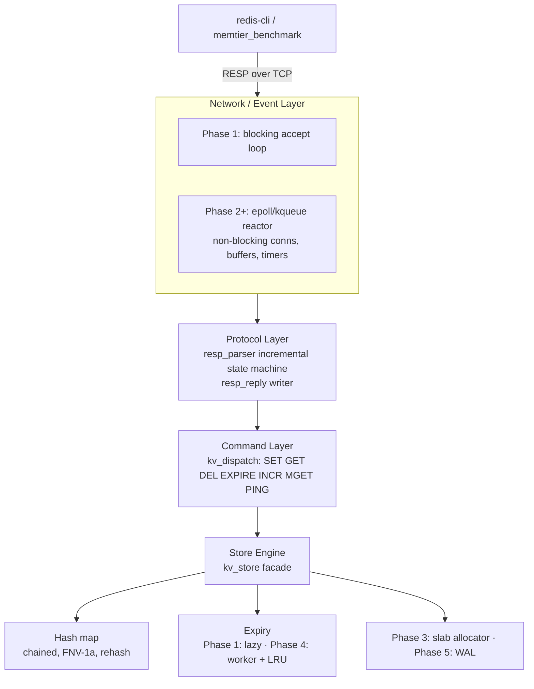

# kvstore — Architecture

A high-performance, asynchronous key-value cache and in-memory storage
engine in pure C (C11, POSIX). No third-party event libraries — the event
loop is written against `epoll`/`kqueue` directly.

```
┌─────────────────────────────────────────────────────────────────────────┐
│                              CLIENTS                                    │
│              redis-cli · memtier_benchmark · custom drivers             │
└───────────────────────────────────┬─────────────────────────────────────┘
                                    │ RESP over TCP (multibulk requests,
                                    │ typed replies: + - : $ *)
                                    ▼
┌─────────────────────────── NETWORK / EVENT LAYER ───────────────────────┐
│  Phase 1: blocking accept loop (one client at a time)                   │
│  Phase 2+: single-threaded reactor                                      │
│            evloop: epoll (Linux) / kqueue (macOS)                       │
│            non-blocking conns, per-conn read/write buffers, timers      │
└───────────────────────────────────┬─────────────────────────────────────┘
                                    ▼
┌─────────────────────────── PROTOCOL LAYER ──────────────────────────────┐
│  resp_parser: incremental byte-driven state machine                     │
│    feed(bytes) → 1 request ready | 0 need more | -1 protocol error      │
│  resp_reply: typed reply writer (+ simple, - error, : int, $ bulk,      │
│              * multibulk; $-1 for nil)                                  │
└───────────────────────────────────┬─────────────────────────────────────┘
                                    ▼
┌─────────────────────────── COMMAND LAYER ───────────────────────────────┐
│  kv_dispatch: command table {name, arity, handler}                      │
│    SET GET DEL EXPIRE INCR MGET (+ PING for tooling)                    │
│  unknown commands & arity violations → Redis-style error replies        │
└───────────────────────────────────┬─────────────────────────────────────┘
                                    ▼
┌─────────────────────────── STORE ENGINE ────────────────────────────────┐
│  kv_store facade (the seam for later phases)                            │
│  ┌────────────────┐  ┌────────────────┐  ┌───────────────────────────┐  │
│  │ hash map       │  │ expiry         │  │ stats                     │  │
│  │ chained,       │  │ Phase 1: lazy  │  │ (key count now; hits/     │  │
│  │ power-of-2     │  │ Phase 4:       │  │  misses, evictions, slab   │  │
│  │ buckets,       │  │ active worker  │  │  usage in later phases)    │  │
│  │ FNV-1a, 0.75   │  │ + LRU eviction │  │                           │  │
│  └────────────────┘  └────────────────┘  └───────────────────────────┘  │
│  Phase 3: slab allocator     Phase 5: WAL (append-only, fsync policy)  │
└─────────────────────────────────────────────────────────────────────────┘
```

Mermaid version (renders on GitHub):



## Request lifecycle (Phase 1)

```
client                                   server
  │  *3\r\n$3\r\nSET\r\n$3\r\nfoo\r\n... │
  ├──────────────────────────────────────▶ read()                     [EINTR-safe]
  │                                      │ resp_parser_feed()  →  1 (request ready)
  │                                      │ kv_dispatch()  →  cmd_set → kv_store_set()
  │                                      │ resp_reply_simple("OK") → "+OK\r\n"
  │  +OK\r\n                             │
  ◀──────────────────────────────────────┤ write_all()  [EINTR-safe, MSG_NOSIGNAL]
```

Multiple requests in one TCP segment (pipelining) work: after a request is
dispatched and `resp_parser_reset()` is called, `resp_parser_feed(NULL, 0)`
re-runs the state machine against buffered bytes.

## Modules

| Module          | Files                       | Responsibility                                        |
|-----------------|-----------------------------|-------------------------------------------------------|
| common          | `include/kvstore/common.h`, `src/util.c` | Error codes, checked allocators, logging, time, int parsing |
| hash map        | `hashmap.h`, `src/hashmap.c` | Binary-safe chained hash table with load-factor rehash |
| protocol        | `protocol.h`, `src/protocol.c` | Incremental RESP parser + reply writer               |
| store           | `store.h`, `src/store.c`     | Command semantics (TTL rules, INCR parsing, lazy expiry) |
| commands        | `commands.h`, `src/commands.c` | Dispatch table and per-command handlers             |
| server          | `server.h`, `src/server.c`   | Socket lifecycle, accept loop, client I/O            |
| main            | `src/main.c`                 | Args, signals, lifecycle                              |

Dependency direction: `main → server → commands → store → hashmap`,
`server → protocol`. Lower layers never depend on higher ones, so the
protocol parser and store can be unit-tested and later reused by the event
loop untouched.

## Data structures (current + planned)

### Phase 1 — shipped

```c
/* hashmap.h */
struct kv_entry {
    char            *key;        /* NUL-terminated for convenience */
    size_t           key_len;    /* authoritative, binary-safe */
    char            *value;
    size_t           value_len;
    int64_t          expire_at_ms; /* 0 == never; wall clock */
    struct kv_entry *next;       /* hash-chain link */
};
typedef struct hashmap {
    kv_entry **buckets;          /* power-of-two count */
    size_t     nbuckets;
    size_t     count;
    size_t     max_load;         /* rehash at count >= nbuckets * 3/4 */
} hashmap;
```

### Phase 2 — event loop (shipped)

```c
/* evloop.h — the shipped Phase 2 interface (see the repo) */
typedef void (*kv_ev_cb)(kv_evloop *el, int fd, uint32_t flags, void *arg);
/* flags: KVC_EV_READ | KVC_EV_WRITE | KVC_EV_ERR (coalesced per fd) */

kvc_err kv_evloop_add(kv_evloop *el, int fd, uint32_t flags, kv_ev_cb, void *arg);
kvc_err kv_evloop_update(kv_evloop *el, int fd, uint32_t flags); /* interest */
kvc_err kv_evloop_del(kv_evloop *el, int fd);
kvc_err kv_evloop_add_timer(kv_evloop *el, int64_t interval_ms, kv_timer_cb, void *arg);

/* kv_conn — one per client, recycled from a free list on close */
struct kv_conn {
    int          fd;        /* -1 while parked on the free list */
    int          state;     /* KVC_CONN_OPEN | KVC_CONN_CLOSE_AFTER_WRITE */
    bool         eof, read_paused;
    char        *rbuf;      /* fixed 16 KiB staging buffer */
    resp_parser  parser;    /* incremental RESP parser (Phase 1, unchanged) */
    resp_reply   reply;     /* scratch space for building one reply */
    char        *wbuf;      /* outbound reply bytes (grows on demand) */
    size_t       woff, wlen;/* write offset + buffered bytes (partial sends) */
    uint32_t     interest;  /* what's actually registered with the loop */
    struct kv_conn *next;     /* free-list link */
    struct kv_conn *all_next; /* teardown-list link */
};
```

Backend split: `evloop_kqueue.c` (BSD/macOS: EVFILT_READ/WRITE/TIMER) and
`evloop_epoll.c` (Linux: epoll + timerfd), selected by the Makefile via
`uname`. Both are level-triggered and share a registration table indexed by
fd, so deleting a conn during callback dispatch is safe. The parser plugs
in unchanged because it was incremental from day one.

Reactor invariants (`server.c`):
- **No busy spin.** `sync_interests()` registers WRITE only while wbuf is
  non-empty; READ drops only under backpressure. Otherwise level-triggered
  loops would spin on always-writable sockets.
- **Backpressure.** Reads pause at 64 KiB buffered output, resume at 16
  KiB — a slow consumer can't balloon memory.
- **Conn recycling.** `close_conn()` parks the `kv_conn` on the free list;
  accept reuses it. Teardown walks `all_next`.
- **Recycling hygiene (bug found under stress).** A conn's `resp_parser`
  must be *fully* cleared on recycle (`resp_parser_clear()`), not just
  argv-reset — otherwise unparsed bytes from the previous client leak into
  the next one and corrupt parsing. `resp_parser_reset()` keeps the buffer
  deliberately, for pipelined drain.

### Phase 3 — slab allocator

```c
/* slab.h (new in Phase 3) */
#define SLAB_CLASS_COUNT 16      /* e.g. 64B … 1 MiB, power-of-two */

typedef struct slab_class {
    size_t chunk_size;           /* payload capacity per item */
    size_t chunks_per_page;      /* chunks per mmap'd slab page */
    void  *free_head;            /* singly-linked free list */
    struct slab_page *pages;     /* list of pages (for teardown) */
    size_t pages_count, used;
} slab_class;

typedef struct slab_allocator {
    slab_class classes[SLAB_CLASS_COUNT];
    /* stats: total_mapped, total_allocated */
} slab_allocator;
```

Phase 3 also consolidates the entry: key and value become one flexible
payload inside a single slab chunk (memcached-style), replacing the three
separate mallocs per entry from Phase 1:

```c
struct kv_entry {                /* Phase 3 shape */
    uint32_t key_len, value_len;
    int64_t  expire_at_ms;
    struct kv_entry *next;       /* hash chain */
    struct kv_entry *lru_prev, *lru_next;   /* Phase 4 */
    char data[];                 /* key bytes, then value bytes */
};
```

### Phase 4 — LRU + expiry worker

```c
/* lru.h (new in Phase 4): doubly linked list of entries */
typedef struct lru {
    struct kv_entry *head;       /* most recently used */
    struct kv_entry *tail;       /* least recently used */
    size_t count;
} lru;
/* kv_entry gains: struct kv_entry *lru_prev, *lru_next; */

/* expire.h (new in Phase 4) */
typedef struct expire_worker {
    pthread_t             thread;
    volatile sig_atomic_t stop;
    struct kv_store      *store;   /* guarded by pthread_rwlock */
    long                  interval_ms;
    size_t                sample_limit;  /* keys sampled per sweep */
} expire_worker;
```

Concurrency model (Phase 4): the reactor thread keeps serving reads/writes;
the expiry/eviction worker thread periodically samples keys (Redis-style
random sampling, not full scans) and evicts LRU tail entries when the
memory high-water mark is exceeded. The store is guarded by a
`pthread_rwlock`: reads take the read lock, mutations and the eviction
worker take the write lock.

### Phase 5 — WAL

```c
/* wal.h (new in Phase 5) */
typedef struct wal {
    int    fd;
    char  *path;
    off_t  offset;
    enum { WAL_FSYNC_EVERYSEC, WAL_FSYNC_ALWAYS, WAL_FSYNC_NO } policy;
} wal;
/* Mutating commands (SET/DEL/EXPIRE/INCR) are appended in RESP form and
   replayed at startup; the parser from Phase 1 doubles as the loader. */
```

## Threading model evolution

| Phase | Threads | What runs where |
|-------|---------|-----------------|
| 1     | 1       | Everything inline in the accept loop |
| 2     | 1       | Single-threaded reactor (epoll/kqueue) — the Redis model |
| 4     | 2+      | Reactor + expiry/eviction worker; `pthread_rwlock` on the store |
| 5     | 2+      | Reactor + worker + optional WAL background fsync thread |

## Key design decisions

1. **Incremental parser from Phase 1.** The state machine consumes bytes as
   they arrive, so the Phase 2 event loop gets it for free — no parser
   rewrite when sockets become non-blocking.
2. **Binary-safe keys/values.** RESP bulk strings are length-prefixed, so
   keys and values may contain `\0`. The hash map compares by length +
   `memcmp`, never `strcmp`.
3. **Chaining over open addressing.** Entries are the unit of ownership for
   LRU (Phase 4) and slabs (Phase 3); chaining lets rehash rewire only
   `next` pointers and keeps entry objects stable across overwrites.
4. **Power-of-two buckets + FNV-1a.** `index = hash & (n - 1)` — no modulo.
   FNV-1a is fine for a cache; a DoS-resistant hash (SipHash) can be swapped
   in later with call sites localized in `hashmap.c`.
5. **Lazy expiration first.** Phase 1 purges expired keys on access; Phase 4
   adds an active worker so TTLs are honored even for untouched keys.
6. **`SET` clears TTL; `INCR` keeps it.** Matches Redis semantics; the store
   layer owns these rules so commands stay thin.
7. **Strict POSIX error handling.** Every syscall is checked; `EINTR`
   retried everywhere (read/send/accept/nanosleep); `SIGPIPE` is ignored and
   `MSG_NOSIGNAL` used where available; `EMFILE`/`ENFILE` backs off instead
   of spinning. Shutdown is signal-driven (`volatile sig_atomic_t` flag, no
   `SA_RESTART`) so blocking calls unwind cleanly.
8. **Memory discipline.** All allocations go through `kvc_*` wrappers that
   log `errno` and abort on OOM; every module has an explicit destroy that
   frees everything, so the whole server is valgrind/ASan clean (see
   `make valgrind` / `make sanitize`).