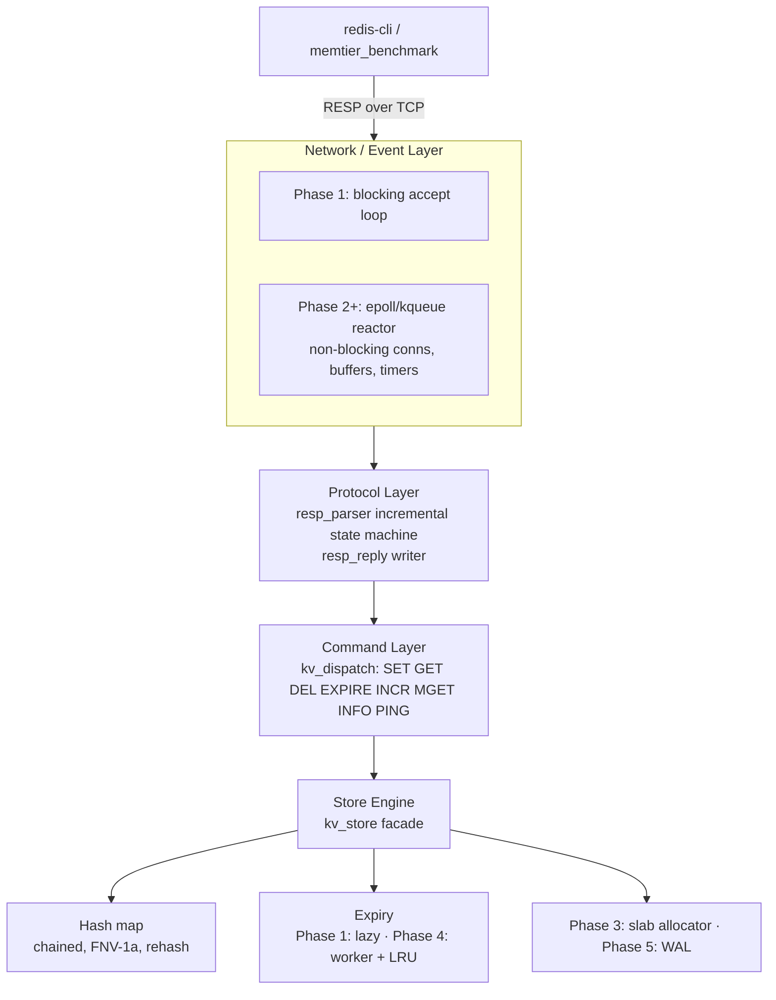

# kvstore — Architecture

A high-performance, asynchronous key-value cache and in-memory storage
engine in pure C (C11, POSIX). No third-party event libraries — the event
loop is written against `epoll`/`kqueue` directly.

```
┌─────────────────────────────────────────────────────────────────────────┐
│                              CLIENTS                                    │
│              redis-cli · memtier_benchmark · custom drivers             │
└───────────────────────────────────┬─────────────────────────────────────┘
                                    │ RESP over TCP (multibulk requests,
                                    │ typed replies: + - : $ *)
                                    ▼
┌─────────────────────────── NETWORK / EVENT LAYER ───────────────────────┐
│  Phase 1: blocking accept loop (one client at a time)                   │
│  Phase 2+: single-threaded reactor                                      │
│            evloop: epoll (Linux) / kqueue (macOS)                       │
│            non-blocking conns, per-conn read/write buffers, timers      │
└───────────────────────────────────┬─────────────────────────────────────┘
                                    ▼
┌─────────────────────────── PROTOCOL LAYER ──────────────────────────────┐
│  resp_parser: incremental byte-driven state machine                     │
│    feed(bytes) → 1 request ready | 0 need more | -1 protocol error      │
│  resp_reply: typed reply writer (+ simple, - error, : int, $ bulk,      │
│              * multibulk; $-1 for nil)                                  │
└───────────────────────────────────┬─────────────────────────────────────┘
                                    ▼
┌─────────────────────────── COMMAND LAYER ───────────────────────────────┐
│  kv_dispatch: command table {name, arity, handler, read/write}         │
│    SET GET DEL EXPIRE INCR MGET INFO (+ PING for tooling)              │
│  unknown commands & arity violations → Redis-style error replies        │
└───────────────────────────────────┬─────────────────────────────────────┘
                                    ▼
┌─────────────────────────── STORE ENGINE ────────────────────────────────┐
│  kv_store facade (the seam for later phases)                            │
│  ┌────────────────┐  ┌────────────────┐  ┌───────────────────────────┐  │
│  │ hash map       │  │ expiry + LRU   │  │ stats (Phase 4)           │  │
│  │ chained,       │  │ Phase 1: lazy  │  │ keys/hits/misses/         │  │
│  │ power-of-2     │  │ Phase 4:       │  │ evictions/used/maxmemory  │  │
│  │ buckets,       │  │ worker thread  │  │ (atomic counters,         │  │
│  │ FNV-1a, 0.75   │  │ + LRU eviction │  │  lock-free to read)       │  │
│  └────────────────┘  └────────────────┘  └───────────────────────────┘  │
│  Phase 3: slab allocator     Phase 4: pthread_rwlock on the store      │
│  Phase 5: WAL (append-only, fsync policy)                              │
└─────────────────────────────────────────────────────────────────────────┘
```

Mermaid version (renders on GitHub):



## Request lifecycle (Phase 1)

```
client                                   server
  │  *3\r\n$3\r\nSET\r\n$3\r\nfoo\r\n... │
  ├──────────────────────────────────────▶ read()                     [EINTR-safe]
  │                                      │ resp_parser_feed()  →  1 (request ready)
  │                                      │ kv_dispatch()  →  cmd_set → kv_store_set()
  │                                      │ resp_reply_simple("OK") → "+OK\r\n"
  │  +OK\r\n                             │
  ◀──────────────────────────────────────┤ write_all()  [EINTR-safe, MSG_NOSIGNAL]
```

Multiple requests in one TCP segment (pipelining) work: after a request is
dispatched and `resp_parser_reset()` is called, `resp_parser_feed(NULL, 0)`
re-runs the state machine against buffered bytes.

## Modules

| Module          | Files                       | Responsibility                                        |
|-----------------|-----------------------------|-------------------------------------------------------|
| common          | `include/kvstore/common.h`, `src/util.c` | Error codes, checked allocators, logging, time, int parsing |
| slab            | `include/kvstore/slab.h`, `src/slab.c` | Fixed-size-class allocator (Phase 3): mmap'd pages, per-class free lists |
| lru             | `include/kvstore/lru.h`, `src/lru.c` | Embedded doubly linked recency list (Phase 4): links live in each kv_entry |
| hash map        | `include/kvstore/hashmap.h`, `src/hashmap.c` | Binary-safe chained hash table + load-factor rehash; atomic count/used-bytes; LRU membership maintenance |
| protocol        | `include/kvstore/protocol.h`, `src/protocol.c` | Incremental RESP parser + reply writer               |
| store           | `include/kvstore/store.h`, `src/store.c` | Command semantics, slab ownership, `pthread_rwlock`, maxmemory/allkeys-lru, expiry sweep (Phase 4) |
| expire          | `include/kvstore/expire.h`, `src/expire.c` | Background expiry worker thread (Phase 4): bounded cursor sweep on a timer |
| commands        | `include/kvstore/commands.h`, `src/commands.c` | Dispatch table, per-command handlers, read/write lock classification, INFO |
| server          | `include/kvstore/server.h`, `src/server.c` | Socket lifecycle, reactor, per-conn I/O, worker start/stop, stats timer |
| main            | `src/main.c`                 | Args (`-p -a -m -e`), signals, lifecycle                              |

Dependency direction: `main → server → commands → store → {hashmap →
slab, lru}` and `store → expire` (the worker drives the store's sweep);
`server → expire` (worker lifecycle). `server → protocol` for the parser.
Lower layers never depend on higher ones, so the protocol parser and
store can be unit-tested and later reused by the event loop untouched.

## Data structures (current + planned)

### Store — entry + hash map (current: Phase 3 chunks, Phase 4 LRU links)

Each entry is a **single flexible-payload slab chunk**: the header, key
bytes, and value bytes share one allocation, so SET/DEL never touch the
heap and hash-chain pointers point straight at slab chunks. Nothing is
NUL-terminated — lengths are authoritative (binary-safe). `chunk_sz` is
the total chunk size, recorded at allocation so `slab_free` finds the
right size class and so an overwrite can tell whether the new value fits
in place:

```c
/* hashmap.h */
struct kv_entry {
    uint32_t         key_len;      /* key bytes at data[0, key_len) */
    uint32_t         value_len;    /* value bytes at data[key_len, ...) */
    uint32_t         chunk_sz;     /* slab chunk size backing this entry */
    int64_t          expire_at_ms; /* 0 == never; wall clock */
    struct kv_entry *next;         /* hash-chain link */
    struct kv_entry *lru_prev;     /* Phase 4 recency list (see lru.h) */
    struct kv_entry *lru_next;
    char             data[];       /* key bytes, then value bytes */
};
/* KV_ENTRY_KEY(e) / KV_ENTRY_VALUE(e) give the byte ranges in data[] */

typedef struct hashmap {
    kv_entry        **buckets;     /* power-of-two count */
    size_t            nbuckets;
    _Atomic size_t    count;       /* atomic: lock-free stats snapshots */
    _Atomic size_t    used_bytes;  /* live chunk bytes (atomic, same reason) */
    size_t            max_load;    /* rehash at count >= nbuckets * 3/4 */
    slab_allocator   *slab;        /* entry chunks come from here */
    struct lru       *lru;         /* attached recency list, or NULL */
} hashmap;
```

Overwrite semantics: if the new key+value footprint fits the entry's
current chunk, the value is updated in place and the entry object is kept
(its slab chunk, expiry, and LRU membership all stay put — recency is
*not* re-created). If it outgrows the chunk, the entry migrates to a
fresh, larger chunk — the bucket link is rewired, `expire_at_ms` is
carried across, LRU membership is moved, and the old chunk is returned
to the slab.

### Store facade (Phase 4 shape)

```c
/* store.h */
typedef struct kv_stats {
    size_t   keys;        /* live entries */
    uint64_t hits, misses, evictions; /* atomic counters */
    size_t   used_bytes;  /* live chunk bytes */
    size_t   maxmemory;   /* budget; 0 = unlimited */
} kv_stats;

typedef struct kv_store {
    hashmap          table;
    slab_allocator   slab;       /* entry chunks live here */
    pthread_rwlock_t lock;       /* one lock guards the whole store */
    lru              lru;        /* store-wide recency (head = MRU) */
    _Atomic uint64_t hits, misses, evictions;
    size_t           maxmemory;      /* eviction budget */
    size_t           expire_cursor;  /* rotating sweep cursor */
} kv_store;
```

`kv_store_stats()` needs no lock: every counter it reads is `_Atomic`
(relaxed), and `maxmemory` is written once before the worker starts.

Concurrency contract (the whole of Phase 4's locking):
- `kv_dispatch` takes the **read lock** for `GET`/`MGET`/`PING`/`INFO` and
  the **write lock** for `SET`/`DEL`/`EXPIRE`/`INCR`, spanning the entire
  handler. That is what keeps the value pointer `kv_store_get` returns
  valid while the RESP reply bytes are copied from it.
- The data-path functions (`kv_store_set/get/del/expire/incr`) do **not**
  lock; their callers must. Only `kv_store_expire_cycle` and
  `kv_dispatch` acquire the lock (plus tests calling the helpers
  directly).
- The expiry worker holds the write lock only for each bounded pass
  (sampling slice + budget enforcement), so the reactor is stalled for at
  most one slice, never a full scan.
- Recency touches on GET happen under the read lock; there is exactly one
  reactor thread, so readers never mutate the LRU list concurrently with
  each other, and the worker can only touch it under the write lock.

### Phase 2 — event loop (shipped)

```c
/* evloop.h — the shipped Phase 2 interface (see the repo) */
typedef void (*kv_ev_cb)(kv_evloop *el, int fd, uint32_t flags, void *arg);
/* flags: KVC_EV_READ | KVC_EV_WRITE | KVC_EV_ERR (coalesced per fd) */

kvc_err kv_evloop_add(kv_evloop *el, int fd, uint32_t flags, kv_ev_cb, void *arg);
kvc_err kv_evloop_update(kv_evloop *el, int fd, uint32_t flags); /* interest */
kvc_err kv_evloop_del(kv_evloop *el, int fd);
kvc_err kv_evloop_add_timer(kv_evloop *el, int64_t interval_ms, kv_timer_cb, void *arg);

/* kv_conn — one per client, recycled from a free list on close */
struct kv_conn {
    int          fd;        /* -1 while parked on the free list */
    int          state;     /* KVC_CONN_OPEN | KVC_CONN_CLOSE_AFTER_WRITE */
    bool         eof, read_paused;
    char        *rbuf;      /* fixed 16 KiB staging buffer */
    resp_parser  parser;    /* incremental RESP parser (Phase 1, unchanged) */
    resp_reply   reply;     /* scratch space for building one reply */
    char        *wbuf;      /* outbound reply bytes (grows on demand) */
    size_t       woff, wlen;/* write offset + buffered bytes (partial sends) */
    uint32_t     interest;  /* what's actually registered with the loop */
    struct kv_conn *next;     /* free-list link */
    struct kv_conn *all_next; /* teardown-list link */
};
```

Backend split: `evloop_kqueue.c` (BSD/macOS: EVFILT_READ/WRITE/TIMER) and
`evloop_epoll.c` (Linux: epoll + timerfd), selected by the Makefile via
`uname`. Both are level-triggered and share a registration table indexed by
fd, so deleting a conn during callback dispatch is safe. The parser plugs
in unchanged because it was incremental from day one.

Reactor invariants (`server.c`):
- **No busy spin.** `sync_interests()` registers WRITE only while wbuf is
  non-empty; READ drops only under backpressure. Otherwise level-triggered
  loops would spin on always-writable sockets.
- **Backpressure.** Reads pause at 64 KiB buffered output, resume at 16
  KiB — a slow consumer can't balloon memory.
- **Conn recycling.** `close_conn()` parks the `kv_conn` on the free list;
  accept reuses it. Teardown walks `all_next`.
- **Recycling hygiene (bug found under stress).** A conn's `resp_parser`
  must be *fully* cleared on recycle (`resp_parser_clear()`), not just
  argv-reset — otherwise unparsed bytes from the previous client leak into
  the next one and corrupt parsing. `resp_parser_reset()` keeps the buffer
  deliberately, for pipelined drain.

### Phase 3 — slab allocator (shipped)

Power-of-two size classes from 64 B to 1 MiB (2^6 … 2^20 — **15** classes;
64 B … 1 MiB contains 15 powers of two, not the 16 the plan sketch
estimated). Each class owns a free list (the next pointer lives inside the
free chunk, so free lists cost nothing extra) and a list of the ~1 MiB
`mmap`'d pages it has grown lazily; `slab_allocator_destroy` walks the
page lists and `munmap`s everything:

```c
/* slab.h */
#define SLAB_CLASS_COUNT 15
#define SLAB_MIN_CHUNK  64u
#define SLAB_MAX_CHUNK  (1024u * 1024u)
#define SLAB_PAGE_TARGET (1024u * 1024u) /* ~1 MiB of chunks per page */

typedef struct slab_page {
    struct slab_page *next;    /* next page of the same class */
    void             *mem;     /* mmap'd chunk area (page-aligned) */
    size_t            mem_len; /* bytes mapped (for munmap) */
} slab_page;

typedef struct slab_class {
    size_t     chunk_size;      /* class size in bytes */
    size_t     chunks_per_page;
    void      *free_head;       /* singly linked free list */
    slab_page *pages;           /* teardown list */
    size_t     total_chunks;    /* chunks ever handed to the free list */
    size_t     free_chunks;     /* chunks currently free */
} slab_class;

struct slab_allocator {
    slab_class classes[SLAB_CLASS_COUNT];
};

kvc_err slab_allocator_init(slab_allocator *sa);
void    slab_allocator_destroy(slab_allocator *sa);
void   *slab_alloc(slab_allocator *sa, size_t size);       /* NULL if > 1 MiB */
void    slab_free(slab_allocator *sa, void *ptr, size_t size);
size_t  slab_class_size(size_t size); /* smallest class >= size, 0 if too big */
```

`kv_store` owns a `slab_allocator` and hands it to the hash map at init,
so all entry memory lives in mmap'd slab pages.

### Phase 4 — LRU + expiry worker (shipped)

```c
/* lru.h: doubly linked list embedded in kv_entry (lru_prev/lru_next) */
typedef struct lru {
    struct kv_entry *head;  /* most recently used */
    struct kv_entry *tail;  /* least recently used */
} lru;
/* lru_push_front / lru_touch / lru_remove / lru_tail — O(1) link ops only;
   the hash map maintains membership (hashmap_set_lru attaches the root). */

/* expire.h: one background worker per server */
typedef struct expire_worker {
    pthread_t      thread;
    atomic_bool    stop;    /* set by expire_worker_stop(), then joined */
    bool           started;
    kv_store      *store;
    long           interval_ms;   /* default 100 ms (10 Hz, like Redis) */
    size_t         sample_limit;  /* entries examined per pass */
} expire_worker;
```

Eviction (`allkeys-lru`): after every write that could grow memory
(SET/INCR), `kv_store` checks `hashmap_used_bytes > maxmemory` and pops
LRU-tail entries until back under budget (or one entry remains). A write
that allocates nothing (an in-place overwrite) never evicts; a single
entry that cannot fit even alone is refused with `KVC_ERR_NOMEM` up front.

Active expiry: the worker wakes every `interval_ms` and runs one bounded
pass — a rotating cursor walks bucket chains examining up to
`sample_limit` entries (Redis-style bounded sampling, deterministic
coverage of the whole keyspace across passes), purging expired entries;
the pass ends with budget enforcement. The per-pass budget scales with the
lock-free key count (capped at 4096) so a full sweep takes ~1 s at the
default cadence while huge tables can't monopolize the CPU.

Locking: one `pthread_rwlock` on `kv_store`. Read-only commands hold the
read lock across the whole handler (borrowed pointers stay valid while the
reply is built); mutators and each worker pass hold the write lock. With a
single reactor thread, readers never contend with each other; the rwlock
arbitrates the reactor against the worker. `expire_worker_stop()` (atomic
flag + `pthread_join`) runs before `kv_store_destroy()`.

### Phase 5 — WAL

```c
/* wal.h (new in Phase 5) */
typedef struct wal {
    int    fd;
    char  *path;
    off_t  offset;
    enum { WAL_FSYNC_EVERYSEC, WAL_FSYNC_ALWAYS, WAL_FSYNC_NO } policy;
} wal;
/* Mutating commands (SET/DEL/EXPIRE/INCR) are appended in RESP form and
   replayed at startup; the parser from Phase 1 doubles as the loader. */
```

## Threading model evolution

| Phase | Threads | What runs where |
|-------|---------|-----------------|
| 1     | 1       | Everything inline in the accept loop |
| 2     | 1       | Single-threaded reactor (epoll/kqueue) — the Redis model |
| 4     | 2+      | Reactor + expiry/eviction worker; `pthread_rwlock` on the store |
| 5     | 2+      | Reactor + worker + optional WAL background fsync thread |

## Key design decisions

1. **Incremental parser from Phase 1.** The state machine consumes bytes as
   they arrive, so the Phase 2 event loop gets it for free — no parser
   rewrite when sockets become non-blocking.
2. **Binary-safe keys/values.** RESP bulk strings are length-prefixed, so
   keys and values may contain `\0`. The hash map compares by length +
   `memcmp`, never `strcmp`.
3. **Chaining over open addressing.** Entries are the unit of ownership for
   LRU (Phase 4) and slabs (Phase 3); chaining lets rehash rewire only
   `next` pointers and keeps entry objects stable across overwrites that
   fit their slab chunk (a grow past the chunk migrates the entry, so
   Phase 4 must relink LRU there).
4. **Power-of-two buckets + FNV-1a.** `index = hash & (n - 1)` — no modulo.
   FNV-1a is fine for a cache; a DoS-resistant hash (SipHash) can be swapped
   in later with call sites localized in `hashmap.c`.
5. **Lazy expiration first.** Phase 1 purges expired keys on access; Phase 4
   adds an active worker so TTLs are honored even for untouched keys. Reads
   never purge (a GET of an expired key misses but leaves the chunk to the
   worker), keeping the read path mutation-free.
6. **One rwlock, coarse and simple.** A single store-wide `pthread_rwlock`
   rather than fine-grained per-bucket or per-entry locks: the reactor is
   single-threaded, so the only contention is worker-vs-reactor, and the
   worker's passes are bounded and brief. Read commands hold the read lock
   for the whole handler precisely because GET returns a borrowed pointer
   into slab memory.
7. **Recency is embedded, not allocated.** LRU links live inside each
   `kv_entry` and the hash map owns membership transitions — no per-entry
   overhead, no separate index to desync.
8. **Atomic stats, no stat lock.** Counters (`keys`, `used_bytes`, hits/
   misses/evictions) are `_Atomic` relaxed reads/writes, so INFO and the
   worker's budget scaling never need the store lock.
9. **`SET` clears TTL; `INCR` keeps it.** Matches Redis semantics; the store
   layer owns these rules so commands stay thin.
10. **Strict POSIX error handling.** Every syscall is checked; `EINTR`
    retried everywhere (read/send/accept/nanosleep); `SIGPIPE` is ignored and
    `MSG_NOSIGNAL` used where available; `EMFILE`/`ENFILE` backs off instead
    of spinning. Shutdown is signal-driven (`volatile sig_atomic_t` flag, no
    `SA_RESTART`) so blocking calls unwind cleanly; the worker uses an
    `atomic_bool` stop flag and is joined before teardown.
11. **Memory discipline.** Entry storage is mmap'd slab pages (Phase 3)
    with explicit `slab_allocator_destroy` teardown; everything else goes
    through `kvc_*` wrappers that log `errno` and abort on OOM. Every
    module has an explicit destroy, so the whole server is valgrind/ASan
    clean (see `make valgrind` / `make sanitize`).